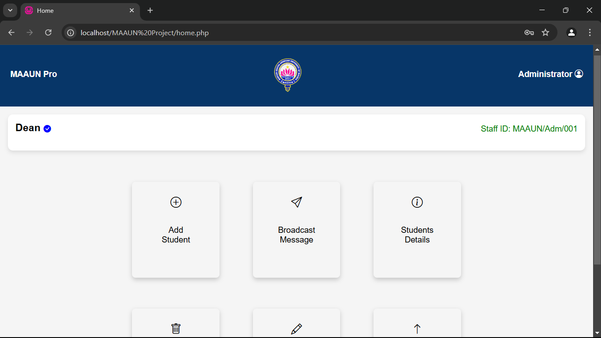

# SQL Injection Project

## Project Overview

This project demonstrates SQL injection and secure coding practices in a simple PHP web application. The project include vulnerability and its corresponding fixes to showcase the importance of security in web development.

### Description

SQL Injection is a web security vulnerability that allows an attacker to interfere with the queries that an application makes to its database. It can allow attackers to view data that they are not normally able to retrieve, potentially allowing them to steal sensitive data. SQL injection can also be used to modify or delete data in the database, leading to unauthorized access and data corruption. This project will solely demonstrate how sql injection could be achieved leading to unauthorized access to a fallacy school portal.

### Vulnerable Code Snippet

```php
<?php
session_start();
include 'db_connect.php'; // Include the connection file

$showNotificationScript = '';

if ($_SERVER["REQUEST_METHOD"] == "POST") {
    $email = $_POST["email"];
    $password = $_POST["password"];

    // Vulnerable version using direct SQL query (no SQL injection protection)
    $sql = "SELECT * FROM users WHERE email = '$email' AND password = '$password'";

    $result = $conn->query($sql);

    // Check if any rows are returned
    if ($result && $result->num_rows > 0) {
        $user = $result->fetch_assoc();

            // There is no manual password checking here (pointing out bad coding practice!).

            $_SESSION["user_id"] = $user["id"];
            $_SESSION["username"] = $user["username"];
            header("Location: home.php");
            exit();

         } else {
             $showNotificationScript = "<script>
                     document.addEventListener('DOMContentLoaded', function() {
                         showNotification('Wrong details, please try again!.', 'error');
                     });
                   </script>";
         }
    }

$conn->close();
?>
```

### Demonstration of the Attack

A link to access the online version of the project is attached down below for self test..

To demonstrate the SQL injection vulnerability, use the following payload in the email field:

' OR 1=1-- (MAKE SURE TO ADD A SPACE AFTER THE TWO HYPHENS)

Expected SQL Query:

SELECT \* FROM users WHERE email = '' OR 1=1-- and password = $password;

In SQL, the "-- " after 1 in the above command will comment whatever comes after them. This will literally tell the system/database to ignore 'and password = $password allowing an attacker to bypass authentication (Password checking) and retrieve the first user record in the database.

## Link for the project

https://bit.ly/maaun-21-cbs-0028

### Screenshots of the SQL Injection in Action

Screenshot 1: Login Form Before SQL Injection.


Screenshot 2: Dashboard outlook after successful penetration (SQL Injection Attack). 

### Secure Code Snippet

Here is the secure version of the login code using prepared statements:

```php

<?php
session_start();
include 'db_connect.php'; // Include the connection file

$showNotificationScript = '';

if ($_SERVER["REQUEST_METHOD"] == "POST") {
    $email = $_POST["email"];
    $password = $_POST["password"];

    // Secure version using prepared statements (SQL injection protection)
    $stmt = $conn->prepare("SELECT * FROM users WHERE email = ?");
    $stmt->bind_param("s", $email);
    $stmt->execute();
    $result = $stmt->get_result();

    if ($result->num_rows > 0) {
        $user = $result->fetch_assoc();

        // Here there is manual password authentication(proving good coding practice.)
        if ($password === $user['password']){

            // Set session variables and redirect to the profile page
            $_SESSION["user_id"] = $user["id"];
            $_SESSION["username"] = $user["username"];
            header("Location: home.php");
            exit();
        } else {
            // Invalid password
            $showNotificationScript = "<script>
                    document.addEventListener('DOMContentLoaded', function() {
                        showNotification('Invalid password.', 'error');
                    });
                  </script>";
        }
    } else {
        // No account found with that email
        $showNotificationScript = "<script>
                document.addEventListener('DOMContentLoaded', function() {
                    showNotification('Wrong details, please try again!', 'error');
                });
              </script>";
    }

    $stmt->close();
}

$conn->close();
?>


```

### Mitigation Explanation

Prepared Statements prevent SQL injection by separating the SQL logic from the data input. When using prepared statements, user input is treated as data, not executable code. This means that even if an attacker tries to inject SQL code, it will not be executed as part of the SQL statement, protecting the application from unauthorized access.

# SQL Injection Demonstration

# Bsc. CyberSecurity (MAAUN-Final-Year-Project) Developed By MAAUN/21/CBS/0028 (Ahmad Abdullahi Yola)
